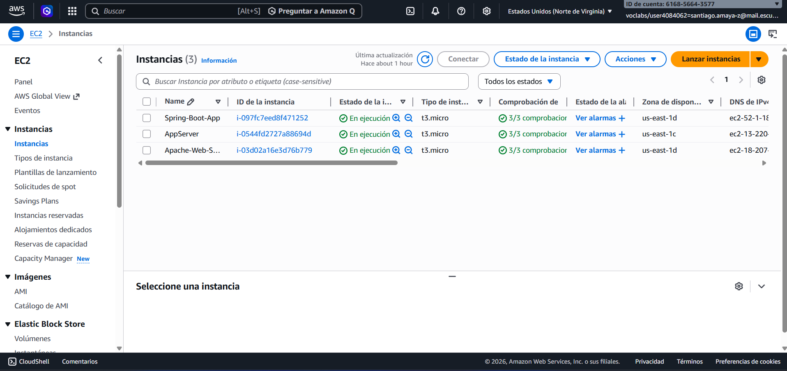
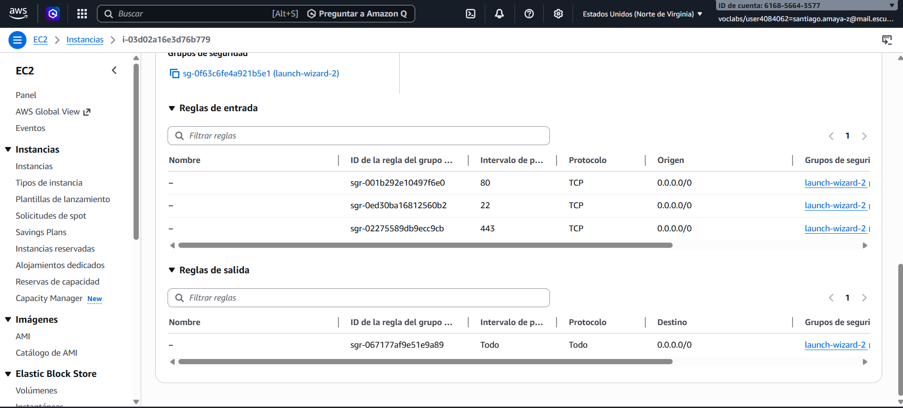
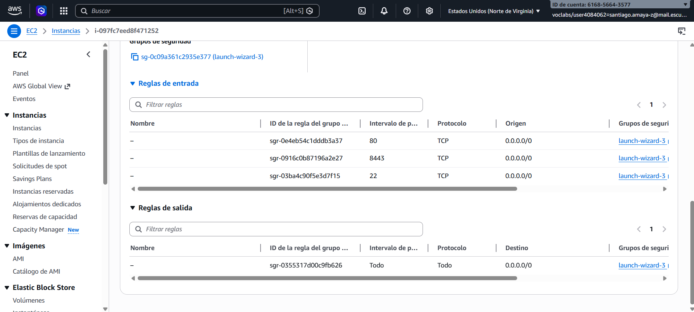
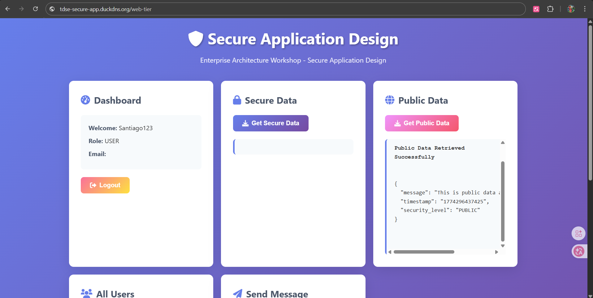
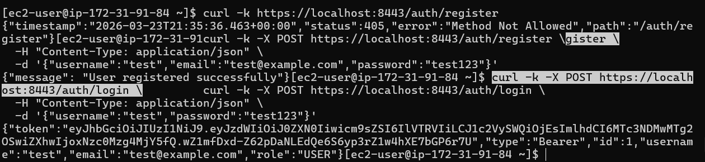
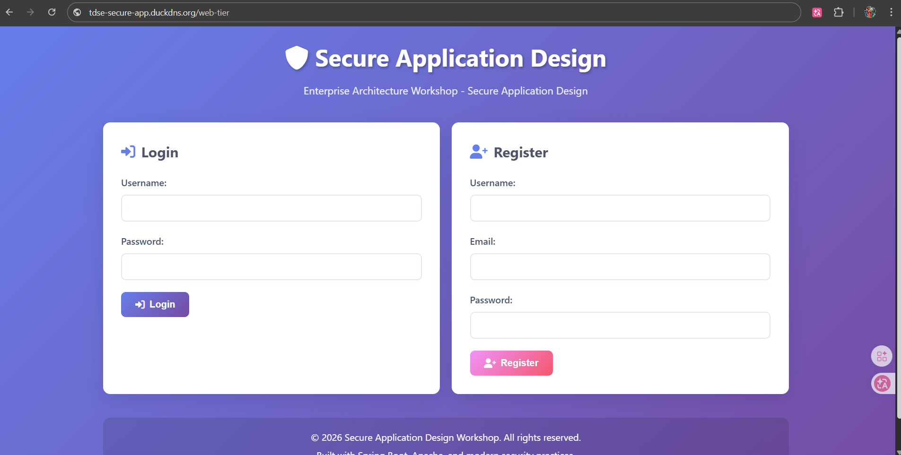
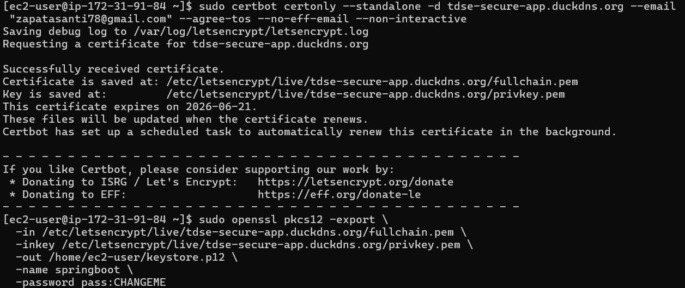

# AWS Academy Deployment Guide
# =============================

## Overview
This guide provides step-by-step instructions for deploying the Secure Application Design project on AWS Academy using two EC2 instances.

## Prerequisites
- AWS Academy account with EC2 access
- Domain name (required for Let's Encrypt certificates)
- SSH key pair for EC2 access
- Git repository access

## Architecture
```
┌─────────────────┐    HTTPS (443)    ┌──────────────────┐
│   User Browser   │ ◄──────────────► │  Apache Server   │
│                 │                  │  (EC2 Instance 1) │
└────────┬────────┘                  └────────┬──────────┘
         │                                   │
         │ HTTPS (8443)                      │
         ▼                                   ▼
┌─────────────────┐                  ┌──────────────────┐
│ Spring Boot API  │ ◄──────────────► │  Database (H2)   │
│  (EC2 Instance 2)│                  │  In-Memory       │
└─────────────────┘                  └──────────────────┘
```

## Step 1: Create EC2 Instances

### Instance 1: Apache Web Server
1. **Launch Instance** in AWS Academy Console
2. **Select**: Amazon Linux 2023
3. **Instance Type**: t2.micro (or larger)
4. **Security Group**: Create new group with rules:
   - HTTP (80) from 0.0.0.0/0
   - HTTPS (443) from 0.0.0.0/0
   - SSH (22) from your IP
5. **Key Pair**: Select your existing key pair
6. **Storage**: 20GB GP2 (default)
7. **Tags**: Name = "Apache-Web-Server"

### Instance 2: Spring Boot Application
1. **Launch Instance** in AWS Academy Console
2. **Select**: Amazon Linux 2023
3. **Instance Type**: t2.micro (or larger)
4. **Security Group**: Create new group with rules:
   - Custom TCP (8443) from Apache security group
   - SSH (22) from your IP
5. **Key Pair**: Select your existing key pair
6. **Storage**: 20GB GP2 (default)
7. **Tags**: Name = "Spring-Boot-App"

## Step 2: Deploy Apache Server (Instance 1)

### 2.1 Connect via SSH
```bash
ssh -i your-key.pem ec2-user@<APACHE_PUBLIC_IP>
```

### 2.2 Clone Repository and Deploy
```bash
# Clone the repository
git clone https://github.com/SantiagoAmaya21/TDSE_secure-application-design.git
cd TDSE_secure-application-design

# Make scripts executable
chmod +x scripts/aws-deploy-apache.sh

# Run deployment script
./scripts/aws-deploy-apache.sh
```

### 2.3 Configure Domain and SSL
```bash
# Install Certbot
sudo dnf install certbot python3-certbot-apache -y

# Generate SSL certificate (replace with your domain)
sudo certbot --apache -d your-domain.com

# Verify SSL configuration
sudo systemctl status httpd
```

### 2.4 Update Frontend Configuration
```bash
# Edit config file to point to Spring server
sudo nano /var/www/html/secure-app/config.js

# Update this line:
BASE_URL: 'https://your-spring-domain.com'
```

## Step 3: Deploy Spring Boot (Instance 2)

### 3.1 Connect via SSH
```bash
ssh -i your-key.pem ec2-user@<SPRING_PUBLIC_IP>
```

### 3.2 Clone Repository and Deploy
```bash
# Clone the repository
git clone https://github.com/SantiagoAmaya21/TDSE_secure-application-design.git
cd TDSE_secure-application-design

# Make scripts executable
chmod +x scripts/aws-deploy-spring.sh
chmod +x scripts/setup-ssl-spring.sh

# Run deployment script
./scripts/aws-deploy-spring.sh
```

### 3.3 Configure SSL for Spring Boot
```bash
# Run SSL setup script (replace with your domain)
./scripts/setup-ssl-spring.sh your-spring-domain.com
```

### 3.4 Update CORS Configuration
```bash
# Edit production configuration
sudo nano /opt/secure-app/application-production.properties

# Update this line with your Apache domain:
cors.allowed-origins=https://your-apache-domain.com

# Restart service
sudo systemctl restart secure-app
```

## Step 4: SSL Certificate Management

### 4.1 Let's Encrypt for Apache
```bash
# Certificate already configured in Step 2
# Check renewal:
sudo certbot certificates

# Manual renewal:
sudo certbot renew
```

### 4.2 Let's Encrypt for Spring Boot
```bash
# Certificate already configured in Step 3
# Check keystore:
ls -la /home/ec2-user/keystore.p12

# Manual renewal:
sudo /home/ec2-user/ssl-renewal.sh
```

## Step 5: Testing and Verification

### 5.1 Test Apache Server
```bash
# Test HTTP (should redirect to HTTPS)
curl -L http://your-apache-domain.com

# Test HTTPS
curl -I https://your-apache-domain.com
```

### 5.2 Test Spring Boot API
```bash
# Test API endpoint
curl -k https://your-spring-domain.com:8443/auth/register \
  -H "Content-Type: application/json" \
  -d '{"username":"test","password":"test123"}'

# Check service status
sudo systemctl status secure-app
```

### 5.3 Test Full Application
1. Open browser: `https://your-apache-domain.com`
2. Register a new user
3. Login with credentials
4. Test all features (secure data, users, messages)

## Step 6: Monitoring and Logs

### 6.1 Apache Logs
```bash
# Access logs
sudo tail -f /var/log/httpd/access_log

# Error logs
sudo tail -f /var/log/httpd/error_log

# System logs
sudo journalctl -u httpd -f
```

### 6.2 Spring Boot Logs
```bash
# Application logs
sudo journalctl -u secure-app -f

# Check recent errors
sudo journalctl -u secure-app --since "1 hour ago" -p err
```

## Step 7: Troubleshooting

### Common Issues and Solutions

#### Issue 1: SSL Certificate Not Working
```bash
# Check certificate status
sudo certbot certificates

# Reissue certificate
sudo certbot --apache -d your-domain.com --force-renewal
```

#### Issue 2: Spring Boot Not Starting
```bash
# Check service status
sudo systemctl status secure-app

# Check logs
sudo journalctl -u secure-app -n 50

# Restart service
sudo systemctl restart secure-app
```

#### Issue 3: CORS Errors
```bash
# Check CORS configuration
sudo cat /opt/secure-app/application-production.properties

# Update allowed origins
sudo sed -i 's/your-apache-domain.com/actual-domain.com/g' /opt/secure-app/application-production.properties
sudo systemctl restart secure-app
```

#### Issue 4: Firewall Issues
```bash
# Check firewall rules
sudo firewall-cmd --list-all

# Add port if missing
sudo firewall-cmd --permanent --add-port=8443/tcp
sudo firewall-cmd --reload
```

## Step 8: Documentation and Screenshots

### Required Screenshots
1. **AWS Console** - EC2 instances running



2. **Security Groups** - Configuration rules





3. **Apache Server** - HTTPS working with padlock



4. **Spring Boot** - API responding via HTTPS



5. **Application** - Login screen



6. **Application** - Dashboard after login


7. **Certificate** - Let's Encrypt details




## Support Resources

- **AWS Academy Documentation**: Check your academy portal
- **Let's Encrypt**: https://letsencrypt.org/docs/
- **Apache HTTP Server**: https://httpd.apache.org/docs/
- **Spring Boot**: https://spring.io/guides/gs/spring-boot/

---

**Note**: This guide assumes you have administrative access to your AWS Academy environment and a registered domain name for SSL certificates.
